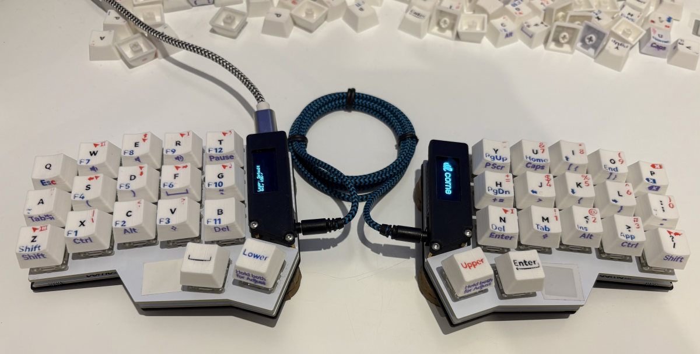

# Super Custom Keycaps

**You need 0.2 mm nozzle to print these keycaps.**

Customizable keycaps with side prints for QMK Tri Layouts opmimized for 3D printing

These keykaps were initially a part of my layout for [TypeS Tri Layout](https://github.com/andruhon/type-s-tri-layout), but it seems like they deserve a separate repo.

Keycaps printed on P1S with AMS, 0.2mm nozzle

## Font

Basic font used to create SVG files is Harmony OS Sans Bold.

## Generating keycaps

Generating keycaps requires OpenSCAD of recent version. I'm using 2025.03.25.ai24452,
but it may work with older versions. Try downloading app image of 2025.03.25.ai24452 if you have any compatibility problems.

The best starting point is to open [keycaps-default-all.scad](keycaps-default-all.scad)

A number of other configurations is available:

| File                                                                      | Description |
| ---                                                                       | --- |
|[keycaps-default-all.scad](keycaps-default-all.scad)                       | Standard keycaps in one print |
|[keycaps-default-left.scad](keycaps-default-left.scad)                     | Standard keycaps left side |
|[keycaps-default-right.scad](keycaps-default-right.scad)                   | Standard keycaps right side |
|[keycaps-default-mix-hack.scad](keycaps-default-mix-hack.scad)             | Allows to print five colours without swapping a roll. See [Mixed colour hack](#mixed-colour-hack)|
|[keycaps-default-one-material.scad](keycaps-default-one-material.scad)     | For users without AMS, prints keycaps with grooves instead of filament, can be painted with acryllic paint, nail polish, permanent markers, or left as they are. Prints 4h faster than default all. |
|[keycaps-default-side-unfilled.scad](keycaps-default-side-unfilled.scad)   | Leaving side letter unfilled saving 3.5h from default all and reducing poop significantly. |
|[keycaps-default-verbose.scad](keycaps-default-verbose.scad)               | Better for beginners or for accidental users. Adjust explicitly tells "hold both", backspace and esc printed three times for each layout |

## Svg preparation process

In Inkscape

- (T) and type letter
- (CTRL+SHIFT+C) to convert letter to path
- (CTRL+D) and then select resize to content
- (CTRL+SHIFT+E) type file name matching short QMK code, select "Plain SVG" and click Export.

Once new svg is added to `/svg` directory the `node measure-svg.js` has to be executed.

## Printing

When loading 3mf or stl file the slicer is likely to ask you
`The object from file keycaps.3mf is too small, and may be in meters or inches. Do you want to scale to millimeters?`
Answer **No**. The file is already in milimeters. It's just keycaps relatevly small.

The next question is
`This file contains several objects positioned at multiple heights. Instead of considering them as multiple objects, should the file be loaded as a single object having multiple parts?`
Answer **Yes**. We don't want letters to end up separately from keycaps.

Go to `Objects`. The object should have five parts. Allocate colours to parts to your liking.

- You need 0.2 mm nozzle to print these keycaps.
- Layer height 0.1 mm
- Exported 3mf file will have 4 subparts. Allocate desired colours to them.
- No supports. Buttons are small enough bridging should work well.
- No AUX fan. Stems will peel if it's on, generally buttons closer to the fan look worse.
- Top layer and infill - Aligned rectilinear.
- Infill direction 90
- Top shell layers 16 to avoid sparse infill (sparce infill won't save anything on such small prints)
- Seams position: Back

## Mixed colour hack
I accidentaly found that one 0.1mm lyer of blue on top of one layer of red
looks almost like black. Which allows a hacky way to produce 5 colour print out of one AMS without swapping roll.

The [keycaps-default-mix-hack.scad](keycaps-default-mix-hack.scad) aplies this hack for center letter,
printing one layer of blue on top of red, making it look nearly as black.
